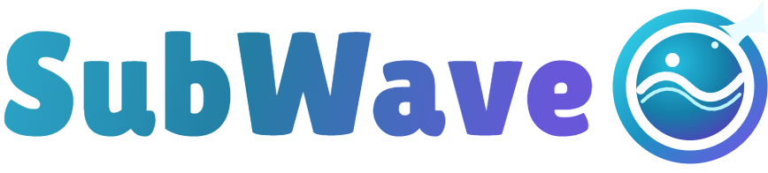
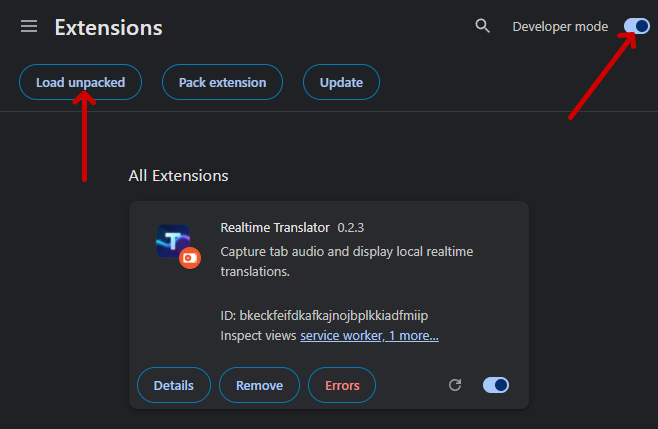
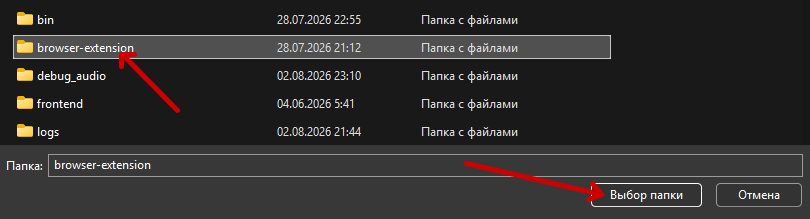
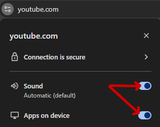
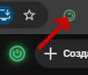

<p align="center">
  
</p>

<h1 align="center">Realtime Subtitle Translator</h1>

<p align="center">
  <a href="LICENSE"></a>
  
</p>

<p align="center">
  <a href="#english">English</a> | <a href="#русский">Русский</a>
</p>

<a id="english"></a>

## 🌊 About Project

SubWave is a local real-time subtitle translator for YouTube and Twitch. It cleans and recognizes speech, translates it with a local LLM, and displays the result directly inside the browser video player.

*This is an early beta version, so it may contain bugs and errors.*

## 🚀 Installation

Download and unpack the repository, or clone it with Git. Open the project folder and run `start.bat`.

On the first launch, the installer will:

- install Python 3.12 through `winget` if a compatible Python is missing;
- create an isolated `.venv` inside the project;
- install the required Python libraries;
- install a compatible llama.cpp runtime for the available hardware;
- open the WebUI in the default browser.

Models are not downloaded during setup. Select the desired profile and language in the WebUI, then press **Start**. SubWave downloads only the required speech-recognition and translation models and caches them for future launches.

### Browser Extension

The extension captures audio from one selected YouTube or Twitch tab and displays translated subtitles inside the player. Install it as an unpacked Chromium extension:

- Open `chrome://extensions` in Chrome or `edge://extensions` in Edge.
- Enable **Developer mode**.
- Click **Load unpacked**.

<p align="center">
  
</p>

- Select the `browser-extension` folder from this repository.

<p align="center">
  
</p>

- Open YouTube or Twitch, click the site-controls icon to the left of the address, and allow **Sound** and **Apps on device**. The latter may be called **Local network access** in some browsers. Without these permissions, Chromium may block tab audio or the local WebUI connection.

<p align="center">
  
</p>

- Pin SubWave to the browser toolbar. With the YouTube or Twitch tab active, click the SubWave toolbar button once to grant capture access. This is required only once for each tab; capture can then also be toggled from the matching button inside the site.

<p align="center">
  
</p>

The toolbar and in-page buttons stay synchronized. Gray means the tab is not selected, tangerine means the WebUI is offline, blue means the WebUI is available but translation is stopped, and green means capture and translation are active. Only one tab is captured at a time.

## 🖥️ Requirements

SubWave supports Windows 10 and Windows 11 x64. Internet access is required during the first installation and while downloading models. NVIDIA and AMD GPUs are supported for translation. Setup selects CUDA for compatible NVIDIA drivers, Vulkan when a Vulkan driver/runtime is available, or CPU otherwise.

- **Max:** a GPU with 8 GB or more of VRAM is recommended; Translate Gemma Sub E4B runs on the GPU via CUDA or Vulkan.
- **Medium:** a GPU with 6 GB or more of VRAM is recommended; Translate Gemma Sub E2B runs on the GPU via CUDA or Vulkan.
- **Potato:** a reasonably modern CPU and sufficient system RAM are recommended; Translate Gemma Sub E2B runs on the CPU and no dedicated GPU is required.

Speech recognition uses the CPU by default so that GPU memory remains available for translation. With the Vulkan llama-server build, CPU is the only available speech-recognition backend.

## 🎛️ WebUI and First Run

The WebUI is available at `http://127.0.0.1:7860`. In **Settings**, you can select the speech-recognition model, translation model, subtitle appearance, performance profile, and translation parameters. In **Control**, you can start, pause, restart, or stop the translator and inspect runtime logs.

Prompt presets can describe translation rules, the speaker's gender, the stream or video's subject, and a small amount of useful context. Keep instructions short and relevant. Example:

```text
TASK: Translate English subtitles into Russian.
RULES: streamer named as Fifi (Фифи), female; plays valorant;
STYLE: friendly.
Translate only CURRENT_SOURCE. PREVIOUS_SOURCE and PREVIOUS_TRANSLATION are context only. Preserve meaning, tone, slang, profanity, uncertainty, repetitions and incomplete speech. Return only the final translation without labels or commentary.
```

The **Health** panel checks the Python environment, required libraries, selected models, local browser bridge, and browser-extension connection. Enable capture once from the extension toolbar button before running Health.

## 🤖 Models

Gemma 4 was specially fine-tuned for natural, context-aware subtitle translation. Two GGUF variants are available:

- [Translate Gemma 4 Sub E4B GGUF](https://huggingface.co/17slever17/translate-gemma-4-sub-e4b-GGUF)
- [Translate Gemma 4 Sub E2B GGUF](https://huggingface.co/17slever17/translate-gemma-4-sub-e2b-GGUF)

Merged Transformers weights are available as [E4B](https://huggingface.co/17slever17/translate-gemma-4-sub-e4b) and [E2B](https://huggingface.co/17slever17/translate-gemma-4-sub-e2b). Speech-recognition models come from the [sherpa-onnx model catalog](https://k2-fsa.github.io/sherpa/onnx/pretrained_models/). The runtime also uses [FireRedVAD](https://github.com/FireRedTeam/FireRedVAD), [DeepFilterNet](https://github.com/Rikorose/DeepFilterNet), and [FastEnhancer](https://github.com/aask1357/fastenhancer).

Developers can set an absolute path to a custom `.gguf` model in Advanced settings. Existing custom files are used directly and are not downloaded or copied by SubWave.

## 👩‍💻 Development

SubWave is an asynchronous local pipeline. The browser extension sends 48 kHz mono PCM over WebSocket; audio filters prepare separate signals for endpoint detection and recognition; FireRedVAD detects speech boundaries; sherpa-onnx recognizes completed utterances; and the local LLM translates only the current subtitle while receiving a bounded previous-subtitle context. Ordered results are published through the local browser bridge and rendered inside the player.

For local development, install the development dependencies, run `start-dev.bat`, and use the existing test and frontend build commands before submitting changes. Useful future improvements include optional speaker diarization, faster and more accurate speech recognition, faster translation, improved speculative decoding, and support for additional operating systems.

## 🤝 Contributions

Contributions are welcome. Reproducible bug reports are especially useful when they include selected models, relevant configuration, logs, and a short legally shareable audio sample. Keep changes focused and verify both real-time latency and output quality.

SubWave is licensed under the [Apache License 2.0](LICENSE). Third-party models and libraries retain their own licenses.

---

<a id="русский"></a>

## 🌊 О проекте

SubWave — локальный переводчик субтитров в реальном времени для YouTube и Twitch. Он очищает и распознаёт речь, переводит её локальной LLM и показывает результат прямо внутри видеоплеера в браузере.

*Это ранняя бета-версия, поэтому она может содержать баги и ошибки.*

## 🚀 Установка

Скачайте и распакуйте репозиторий либо клонируйте его через Git. Откройте папку проекта и запустите `start.bat`.

При первом запуске установщик:

- установит Python 3.12 через `winget`, если совместимая версия Python не найдена;
- создаст изолированное окружение `.venv` внутри проекта;
- установит необходимые Python-библиотеки;
- установит совместимый runtime llama.cpp для доступного оборудования;
- откроет WebUI в браузере по умолчанию.

Модели не скачиваются во время установки. Выберите в WebUI профиль и язык, затем нажмите **Start**. SubWave скачает только необходимые модели распознавания и перевода и сохранит их для следующих запусков.

### Расширение браузера

Расширение захватывает звук одной выбранной вкладки YouTube или Twitch и показывает переведённые субтитры внутри плеера. Установите его как распакованное Chromium-расширение:

- Откройте `chrome://extensions` в Chrome или `edge://extensions` в Edge.
- Включите **Режим разработчика**.
- Нажмите **Загрузить распакованное расширение**.

<p align="center">
  
</p>

- Выберите папку `browser-extension` из этого репозитория.

<p align="center">
  
</p>

- Откройте YouTube или Twitch, нажмите значок управления сайтом слева от адреса и разрешите **Звук** и **Приложения на устройстве**. В некоторых браузерах второй пункт называется **Доступ к локальной сети**. Без этих разрешений Chromium может блокировать звук вкладки или подключение к локальному WebUI.

<p align="center">
  
</p>

- Закрепите SubWave на панели браузера. Пока вкладка YouTube или Twitch активна, один раз нажмите кнопку SubWave в панели, чтобы выдать доступ к захвату. Для каждой вкладки это требуется только один раз; затем захват можно переключать и кнопкой внутри сайта.

<p align="center">
  
</p>

Кнопки в панели браузера и на странице синхронизированы. Серый цвет означает, что вкладка не выбрана, мандариновый — WebUI недоступен, синий — WebUI доступен, но перевод остановлен, зелёный — захват и перевод активны. Одновременно захватывается только одна вкладка.

## 🖥️ Требования

SubWave поддерживает Windows 10 и Windows 11 x64. Интернет нужен во время первой установки и скачивания моделей. Для перевода поддерживаются видеокарты NVIDIA и AMD. Установщик выбирает CUDA при наличии совместимого драйвера NVIDIA, Vulkan при наличии драйвера и среды Vulkan, иначе CPU.

- **Max:** рекомендуется видеокарта с 8 ГБ видеопамяти или более; Translate Gemma Sub E4B работает на GPU через CUDA или Vulkan.
- **Medium:** рекомендуется видеокарта с 6 ГБ видеопамяти или более; Translate Gemma Sub E2B работает на GPU через CUDA или Vulkan.
- **Potato:** рекомендуются достаточно современный процессор и достаточный объём оперативной памяти; Translate Gemma Sub E2B работает на CPU, дискретная видеокарта не требуется.

Распознавание речи по умолчанию работает на CPU, чтобы видеопамять оставалась доступной модели перевода. Со сборкой llama-server для Vulkan распознавание доступно только на CPU.

## 🎛️ WebUI и первый запуск

WebUI доступен по адресу `http://127.0.0.1:7860`. Во вкладке **Settings** можно выбрать модель распознавания, модель перевода, внешний вид субтитров, профиль производительности и параметры перевода. Во вкладке **Control** можно запустить, поставить на паузу, перезапустить или остановить переводчик и посмотреть runtime-логи.

В пресете промпта можно задать правила перевода, род говорящего, происходящее на стриме или видео и небольшой полезный контекст. Инструкции лучше делать короткими и относящимися к текущему контенту. Пример:

```text
TASK: Translate English subtitles into Russian.
RULES: streamer named as Fifi (Фифи), female; plays valorant;
STYLE: friendly.
Translate only CURRENT_SOURCE. PREVIOUS_SOURCE and PREVIOUS_TRANSLATION are context only. Preserve meaning, tone, slang, profanity, uncertainty, repetitions and incomplete speech. Return only the final translation without labels or commentary.
```

Панель **Health** проверяет Python-окружение, необходимые библиотеки, выбранные модели, локальный browser bridge и подключение расширения. Перед запуском Health один раз включите захват кнопкой расширения в панели браузера.

## 🤖 Модели

Gemma 4 была специально дообучена для естественного перевода субтитров с учётом контекста. Доступны два GGUF-варианта:

- [Translate Gemma 4 Sub E4B GGUF](https://huggingface.co/17slever17/translate-gemma-4-sub-e4b-GGUF)
- [Translate Gemma 4 Sub E2B GGUF](https://huggingface.co/17slever17/translate-gemma-4-sub-e2b-GGUF)

Объединённые Transformers-веса доступны как [E4B](https://huggingface.co/17slever17/translate-gemma-4-sub-e4b) и [E2B](https://huggingface.co/17slever17/translate-gemma-4-sub-e2b). Модели распознавания скачиваются из [каталога sherpa-onnx](https://k2-fsa.github.io/sherpa/onnx/pretrained_models/). Runtime также использует [FireRedVAD](https://github.com/FireRedTeam/FireRedVAD), [DeepFilterNet](https://github.com/Rikorose/DeepFilterNet) и [FastEnhancer](https://github.com/aask1357/fastenhancer).

Разработчики могут указать абсолютный путь к собственной `.gguf`-модели в Advanced settings. Существующие пользовательские файлы используются напрямую и не скачиваются и не копируются SubWave.

## 👩‍💻 Для разработчиков

SubWave представляет собой асинхронный локальный конвейер. Расширение передаёт mono PCM 48 кГц через WebSocket; аудиофильтры подготавливают отдельные сигналы для определения границ и распознавания; FireRedVAD находит границы речи; sherpa-onnx распознаёт завершённые реплики; локальная LLM переводит только текущий субтитр и получает ограниченный контекст предыдущих реплик. Результаты сохраняют порядок, публикуются через локальный browser bridge и отображаются внутри плеера.

Для локальной разработки установите development-зависимости, запустите `start-dev.bat` и перед отправкой изменений выполните существующие тесты и сборку frontend. Полезные направления развития: необязательная диаризация говорящих, ускорение и повышение точности распознавания, ускорение перевода, улучшение speculative decoding и поддержка других операционных систем.

## 🤝 Участие в разработке

Вклад в проект приветствуется. Особенно полезны воспроизводимые отчёты об ошибках с указанием выбранных моделей, нужной части конфигурации, логов и короткого аудиофрагмента, если его можно распространять по закону. Старайтесь делать сфокусированные изменения и проверять одновременно задержку в реальном времени и качество результата.

SubWave распространяется по [Apache License 2.0](LICENSE). Сторонние модели и библиотеки сохраняют собственные лицензии.
